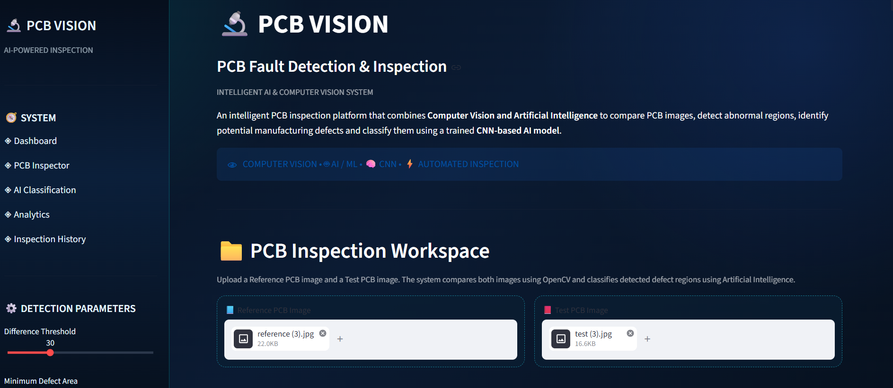
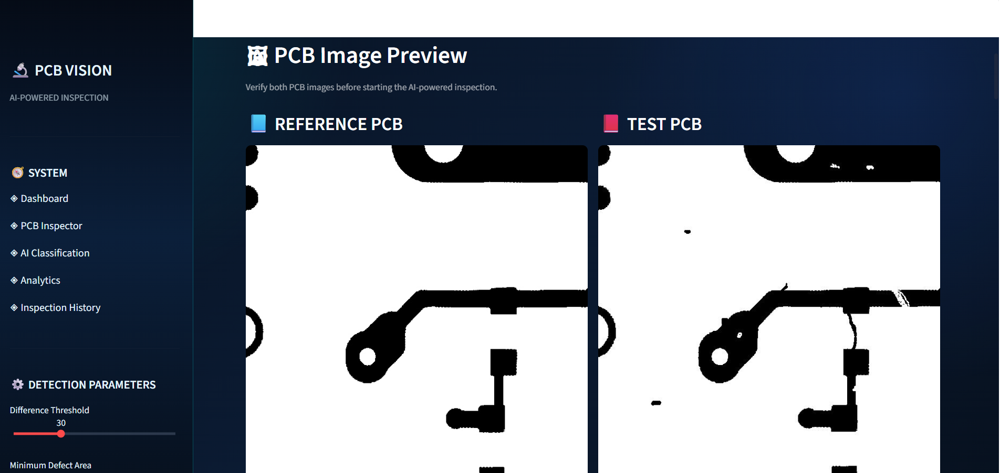
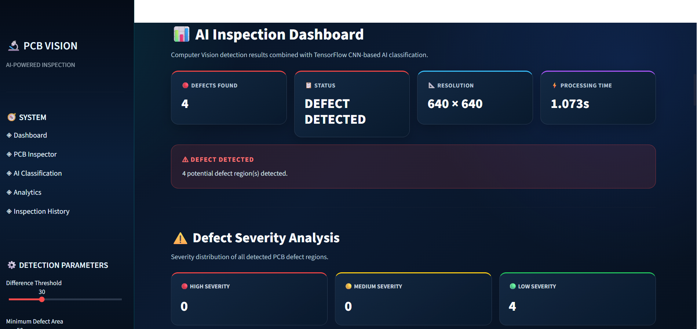
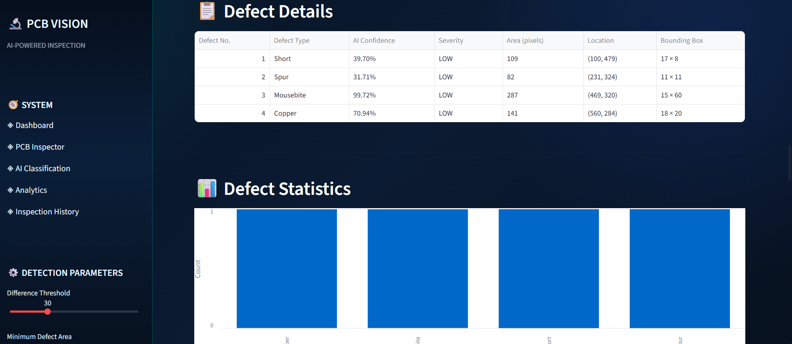
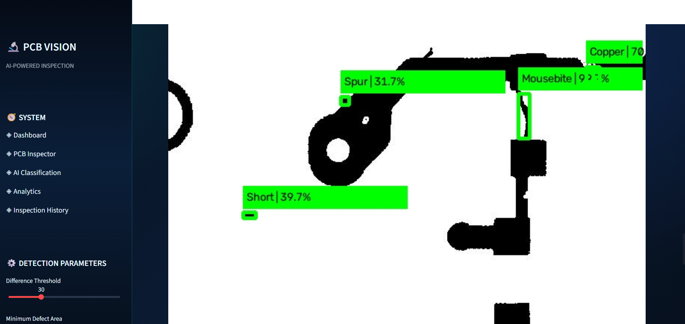

# 🔍 PCB VISION

**AI-Powered PCB Fault Detection & Inspection**

Automatically detect and classify manufacturing defects on Printed Circuit Boards by comparing a reference (defect-free) image against a test image — powered by classical Computer Vision and a TensorFlow CNN.


---

## 📖 Overview

PCB VISION compares a **Reference PCB image** with a **Test PCB image** to automatically flag suspicious regions and classify them into one of six manufacturing defect categories — reducing dependence on slow, manual visual inspection.

The pipeline combines:
- 🖼️ **OpenCV** — image differencing, thresholding, morphological processing, and contour detection
- 🧠 **TensorFlow/Keras CNN** — classification of detected regions
- 📊 **Streamlit** — interactive dashboard for upload, inspection, analytics, and reporting

> ⚠️ This is a **portfolio/prototype system**, not a certified Automated Optical Inspection (AOI) tool. See [Limitations](#-limitations).

---

## 🎥 Demo

**1. Upload Reference & Test PCB images**

<p align="center">
  
</p>

**2. Preview both images before inspection**

<p align="center">
  
</p>

**3. AI Inspection Dashboard**

<p align="center">
  
</p>

**4. Defect Details & Statistics**

<p align="center">
  
</p>

**5. Final Defect Detection with Bounding Boxes**

<p align="center">
  
</p>

**Example detection output (from an actual run):**

| Defect No. | Defect Type | AI Confidence | Severity | Area (pixels) |
|---|---|---|---|---|
| 1 | Short | 39.70% | LOW | 109 |
| 2 | Spur | 31.71% | LOW | 82 |
| 3 | Mousebite | 99.72% | LOW | 287 |
| 4 | Copper | 70.94% | LOW | 141 |

---

## ✨ Features

- 📤 Upload Reference & Test PCB images
- 🔎 Automated defect region detection via image differencing
- 🎛️ Adjustable **Difference Threshold** and **Minimum Defect Area**
- 🧠 CNN-based classification into 6 defect types
- 📈 AI confidence score per prediction
- 🚦 Severity analysis (LOW / MEDIUM / HIGH) based on region area
- 🖼️ Bounding-box visualization on the PCB image
- 🕒 Inspection history (session-based)
- 📄 Downloadable PDF inspection reports

---

## 🧩 Defect Categories

The CNN classifies detected regions into one of six classes from the **DeepPCB** dataset:

| Category | Description |
|---|---|
| **Copper** | Copper-related defect |
| **Mousebite** | Irregular edge/copper-region pattern |
| **Open** | Interrupted conductive connection |
| **Pin-hole** | Small hole-like defect |
| **Short** | Unwanted connection between separate conductive regions |
| **Spur** | Unwanted conductive extension/branch |

---

## 🏗️ How It Works

```
Reference PCB Image  +  Test PCB Image
                ↓
        Image Preprocessing
                ↓
        Grayscale Conversion
                ↓
          Image Difference
                ↓
            Thresholding
                ↓
      Morphological Processing
                ↓
          Contour Detection
                ↓
      Defect Region Extraction (ROI)
                ↓
          CNN Classification
                ↓
          Severity Analysis
                ↓
        Streamlit Dashboard
                ↓
      Result Image / PDF Report
```

**Severity rule** (based on detected region area):

| Area | Severity |
|---|---|
| < 500 | 🟢 LOW |
| 500 – 1499 | 🟡 MEDIUM |
| ≥ 1500 | 🔴 HIGH |

---

## 🛠️ Tech Stack

| Technology | Purpose |
|---|---|
| Python | Core language |
| OpenCV | Image processing & defect localization |
| TensorFlow / Keras | CNN model inference |
| Streamlit | Web dashboard |
| NumPy | Array/image operations |
| Pandas | Data handling & analytics |
| ReportLab | PDF report generation |
| Pillow | Image handling |
| DeepPCB | Defect dataset |

---

## 📁 Project Structure

```
PCB-Fault-Detection/
│
├── app.py                     # Main Streamlit application
├── pcb_defect_model.keras     # Trained CNN model
├── requirements.txt           # Python dependencies
├── README.md
├── .gitignore
│
├── dataset/
│   ├── reference/
│   │   └── reference.jpg
│   └── test/
│       └── test.jpg
│
└── outputs/
    └── result.jpg
```

---

## 🚀 Getting Started

### Prerequisites
- Python 3.x installed
- pip package manager

### Installation

```bash
# 1. Clone the repository
git clone https://github.com/<manas7electroengg>/PCB-Fault-Detection.git
cd PCB-Fault-Detection

# 2. Install dependencies
python -m pip install -r requirements.txt

# 3. Run the app
python -m streamlit run app.py
```

The app will open at:

```
http://localhost:8501
```

### Usage

1. Upload a **Reference PCB** image (defect-free)
2. Upload a **Test PCB** image (to be inspected)
3. (Optional) Adjust **Difference Threshold** and **Minimum Defect Area**
4. Click **Start Inspection**
5. Review detected defects, AI classification, confidence & severity
6. Download the result image or generate a **PDF report**

---

## ☁️ Deployment

This app can be deployed on **Streamlit Community Cloud** (or any Streamlit-compatible host):

1. Push the project to GitHub (include `app.py`, `pcb_defect_model.keras`, `requirements.txt`)
2. Connect the repo on your Streamlit hosting platform
3. Deploy — you'll get a public URL that anyone can access without installing Python

---

## ⚠️ Limitations

- Reference and Test images should be reasonably aligned (position/rotation/scale differences can cause false positives)
- Sensitive to lighting condition changes
- CNN can only recognize defect types present in its training data
- Severity is a **project-defined**, area-based heuristic — not an industrial standard
- No claimed model accuracy unless independently evaluated on a labeled test set
- Intended as a **prototype/portfolio project**, not a certified industrial AOI system

---

## 🔮 Future Improvements

- [ ] Automatic image alignment
- [ ] Real-time camera-based inspection
- [ ] Improved CNN architectures / transfer learning
- [ ] Object detection–based defect localization
- [ ] Image segmentation for precise defect shapes
- [ ] Larger, more diverse training dataset
- [ ] Database-backed inspection history
- [ ] Cloud deployment for public access
- [ ] Industrial camera & controlled lighting integration

---

## 👤 Author

**Manas Pratap Singh**
Branch: Electronics Engineering

---

## 📄 License

This project is licensed under the MIT License — feel free to use and adapt it.

---

<p align="center">Made with Python, OpenCV & TensorFlow 🧠</p>